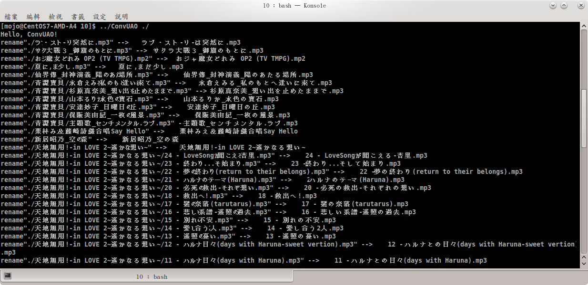

# Convert UAO

將Unicode補完計畫的日文字碼(U+F6F7 ~)的檔名轉換成unicode日文字碼(U+3041 ~)

 

## Required 

cmake 2.6 以上

gcc8 以上支援C++11 的編譯器

## How to compile

```
cd ConvUAO
mkdir build
cd build
cmake ../
make
```

## How to perform

./ConvUAO directory